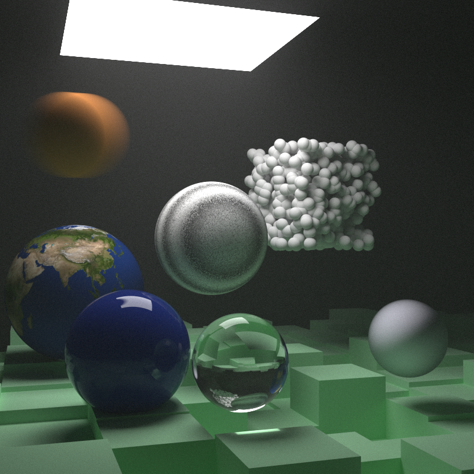

# Less Simple Ray Tracer

I built this in Odin as a means of learning a bit of Odin. I tried to follow the book closely, but there are many more differences with Odin than there was when I built this in Rust. I did get some help from LLM prompts, but mostly for troubleshooting, code search, and understanding programming theory better. I tried to write as much of the code myself and I don't use anything like Cursor or Claude code to write because this project was created with the intent of learning how these things work.

The core of this project was built by following the book series by Perter Shirley, Trevor David Black, and Steve Hollasch - [_Ray Tracing in One Weekend_](https://raytracing.github.io/)

## Unique things about the current state

- There's a fairly accurate Bokeh effect implemented to simulate the camera aperture as either round, polygonal, or pointed (star shaped).
- A lot of camera settings such as fov, defocus, and ev_scale are set by digital camera settings rather than directly since I'm more familiar with those.
  - Accuracy for these settings needs to be tested, and will be done later.
- There's multithreading, but no single threading (the option will be added later)
- There's a basic implementation Oren Nayar and Burley (Disney) diffuse texture solver used (surprisingly little overhead for now). That said, metal still uses a basic Lambertian solver since I was just going through the book and wasn't building this to really integrate it into anything.

## Goals with this project

- [ ] Add CLI commands and single threaded renders
- [x] Add SDL3 integration with basic keyboard and camera controls.
- [ ] Add PNG and TIFF image saving
- [ ] Add debugging tools
- [ ] Add GPU render pipeline
- [ ] Add file loading and saving
[ ] Add better camera lens simulation
  - Camera lenses actually distort the image a lot before it gets to the sensor.
  - I want to be able to create lens stacks since most camera lenses are actually multiples stacked on one another.
  - I'd also like to simulate zoom using the lenses
  - I'd also like to add wavelength tracking so that we can also simulate IR and UV just for fun.
- [x] Refactor directory structure to be less of a headache (Odin likes things flat and specific, but that's counter too my organizational tendencies)
- [ ] Optimize path tracer to be faster
- [ ] Build more robust materials system
- [ ] Add other primitives
